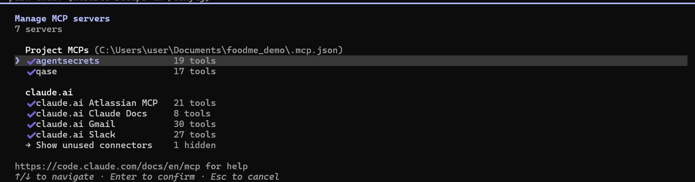
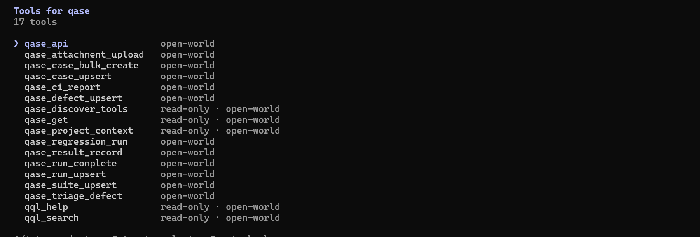
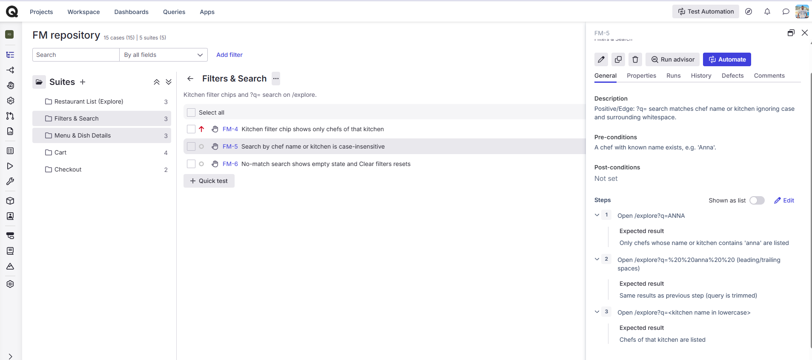
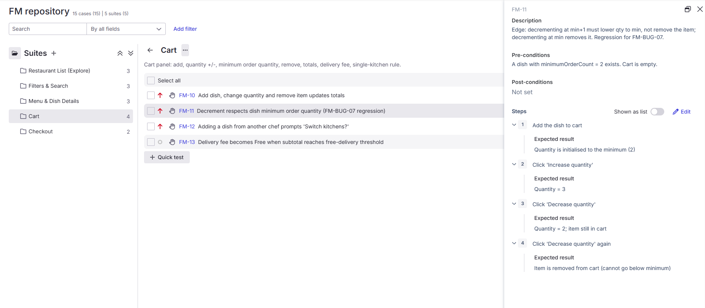
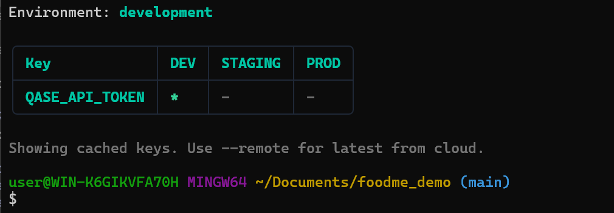
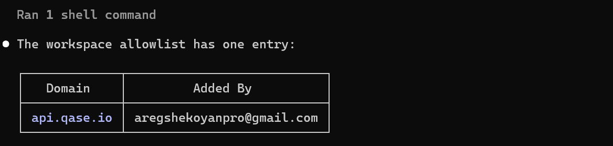
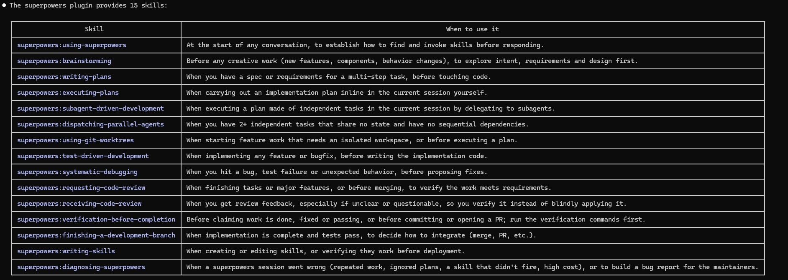

# Homework – Session 4

Qase test management via MCP, secure token handling with AgentSecrets, and the superpowers plugin.

## 1. Qase MCP connected via `.mcp.json`

The Qase MCP server is registered in the project-level `.mcp.json`:

```json
{
  "mcpServers": {
    "qase": {
      "command": "agentsecrets",
      "args": ["env", "--", "npx", "-y", "@qase/mcp-server"]
    },
    "agentsecrets": {
      "command": "agentsecrets",
      "args": ["mcp", "serve"]
    }
  }
}
```

The `qase` server runs `@qase/mcp-server` through `agentsecrets env --`, so the API token is injected at process start (see section 3). The file contains no secrets.

Screenshots:

- MCP servers connected: 
- Qase tools available in Claude Code: 

## 2. Test cases uploaded to Qase project FM

15 test cases were uploaded to Qase project **FM** (FoodMe), organised in 5 suites. Priorities are as stored in Qase.

| ID | Title | Suite | Priority |
|----|-------|-------|----------|
| FM-1 | Explore page lists active chefs with count | Restaurant List (Explore) | High |
| FM-2 | Explore pagination navigates between pages | Restaurant List (Explore) | Medium |
| FM-3 | Explore shows error state and recovers on retry when API fails | Restaurant List (Explore) | Medium |
| FM-4 | Kitchen filter chip shows only chefs of that kitchen | Filters & Search | High |
| FM-5 | Search by chef name or kitchen is case-insensitive | Filters & Search | Medium |
| FM-6 | No-match search shows empty state and Clear filters resets | Filters & Search | Medium |
| FM-7 | Chef menu is grouped by tags and dish modal opens | Menu & Dish Details | High |
| FM-8 | Selected dish additions increase the cart line price | Menu & Dish Details | Medium |
| FM-9 | Non-existent chef id shows 'Chef not found' | Menu & Dish Details | Low |
| FM-10 | Add dish, change quantity and remove item updates totals | Cart | High |
| FM-11 | Decrement respects dish minimum order quantity (FM-BUG-07 regression) | Cart | High |
| FM-12 | Adding a dish from another chef prompts 'Switch kitchens?' | Cart | High |
| FM-13 | Delivery fee becomes Free when subtotal reaches free-delivery threshold | Cart | Medium |
| FM-14 | Delivery checkout with cash places order and allows tracking | Checkout | High |
| FM-15 | Checkout form validation blocks invalid input | Checkout | High |

Suite sizes: Restaurant List (3), Filters & Search (3), Menu & Dish Details (3), Cart (4), Checkout (2).

Screenshots:

- Project FM with suites and cases in Qase: 
- Example case with steps (FM-11): 

## 3. AgentSecrets setup

Goal: the Qase API token never reaches the agent (Claude) or any file in the repo.

- **Keychain storage** – the token is stored as the secret `QASE_API_TOKEN` (environment `development`) in the OS keychain through AgentSecrets. It is not in `.mcp.json`, `.env`, shell history or the repo.
- **Allowlist** – the AgentSecrets workspace allowlist contains a single domain, `api.qase.io`. Credentials can only be injected into requests to that host.
- **Wrapped server** – the `qase` MCP server is launched as `agentsecrets env -- npx -y @qase/mcp-server`. AgentSecrets resolves the secret from the keychain and sets it in the child process environment only, so the token exists only inside the MCP server process.
- **Agent side** – the `agentsecrets` MCP server (`agentsecrets mcp serve`) exposes only key names and metadata (for example `list_keys` returns `QASE_API_TOKEN`, never its value).

Verified state: authenticated, keychain auth configured, `QASE_API_TOKEN` present and in sync, allowlist = `api.qase.io`.

Screenshots:

- Keychain / key list (names only): 
- Allowlist: 

## 4. Superpowers plugin skills

| Skill | When to use it |
|-------|----------------|
| `superpowers:using-superpowers` | At the start of any conversation, to establish how to find and invoke skills before responding. |
| `superpowers:brainstorming` | Before any creative work (new features, components, behavior changes), to explore intent, requirements and design first. |
| `superpowers:writing-plans` | When you have a spec or requirements for a multi-step task, before touching code. |
| `superpowers:executing-plans` | When carrying out an implementation plan inline in the current session yourself. |
| `superpowers:subagent-driven-development` | When executing a plan made of independent tasks in the current session by delegating to subagents. |
| `superpowers:dispatching-parallel-agents` | When you have 2+ independent tasks that share no state and have no sequential dependencies. |
| `superpowers:using-git-worktrees` | When starting feature work that needs an isolated workspace, or before executing a plan. |
| `superpowers:test-driven-development` | When implementing any feature or bugfix, before writing the implementation code. |
| `superpowers:systematic-debugging` | When you hit a bug, test failure or unexpected behavior, before proposing fixes. |
| `superpowers:requesting-code-review` | When finishing tasks or major features, or before merging, to verify the work meets requirements. |
| `superpowers:receiving-code-review` | When you get review feedback, especially if unclear or questionable, so you verify it instead of blindly applying it. |
| `superpowers:verification-before-completion` | Before claiming work is done, fixed or passing, or before committing or opening a PR; run the verification commands first. |
| `superpowers:finishing-a-development-branch` | When implementation is complete and tests pass, to decide how to integrate (merge, PR, etc.). |
| `superpowers:writing-skills` | When creating or editing skills, or verifying they work before deployment. |
| `superpowers:diagnosing-superpowers` | When a superpowers session went wrong (repeated work, ignored plans, a skill that didn't fire, high cost), or to build a bug report for the maintainers. |

Screenshot: 
